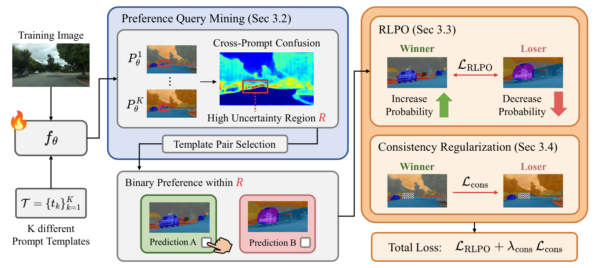

# Preference-Guided Adaptation for Open-Vocabulary Semantic Segmentation via Prompt Disagreement

<p align="center">
  <a href="https://blue-531.github.io/">Hyun-Kurl Jang</a>,
  <a href="https://jihun1998.github.io/">Jihun Kim</a>,
  Kuk-Jin Yoon
  <br>
  KAIST
  <br>
  <b>NeurIPS 2026</b>
</p>

<p align="center">
  <a href="https://blue-531.github.io/pref-ovss/">Project Page</a> |
  Paper (coming soon)
</p>


## 💥 News

- **[2026.09]** Our paper is accepted to **NeurIPS 2026** 🎉!
- **[2026.09]** The [project page](https://blue-531.github.io/pref-ovss/) is online.
- Code will be released soon. Stay tuned!


## Introduction

Open-vocabulary semantic segmentation (OVSS) models degrade in specialized domains such as medical
imaging, remote sensing and industrial inspection, where dense pixel-level masks for adaptation are
costly and require expert knowledge. We propose a **preference-guided adaptation** framework that
replaces dense mask supervision with **binary preferences**. Different prompt templates produce
systematically different segmentations of the same image, a phenomenon we call **prompt disagreement**,
and we repurpose it as a built-in source of preference supervision. We mine a localized preference
query from the region where the templates disagree most, and adapt the model with
**R**egion-**L**ocalized **P**reference **O**ptimization (**RLPO**) together with a consistency
regularizer that stabilizes the prediction outside the queried region. On the MESS benchmark, the
method improves SAN and CAT-Seg (CLIP ViT-B/16 and ViT-L/14) without any pixel-level annotation,
e.g. **+10.6 mIoU** on average for CAT-Seg ViT-L/14, and remains effective under noisy preferences.




## Code

Coming soon: installation, MESS dataset preparation, and adaptation / evaluation scripts for the
CAT-Seg and SAN backbones.


## Citation

```bibtex
@inproceedings{jang2026preference,
  title     = {Preference-Guided Adaptation for Open-Vocabulary
               Semantic Segmentation via Prompt Disagreement},
  author    = {Jang, Hyun-Kurl and Kim, Jihun and Yoon, Kuk-Jin},
  booktitle = {Advances in Neural Information Processing Systems (NeurIPS)},
  year      = {2026}
}
```


## Acknowledgement

We thank [CAT-Seg](https://github.com/cvlab-kaist/CAT-Seg), [SAN](https://github.com/MendelXu/SAN)
and [MESS](https://github.com/blumenstiel/MESS) for sharing their source code.
